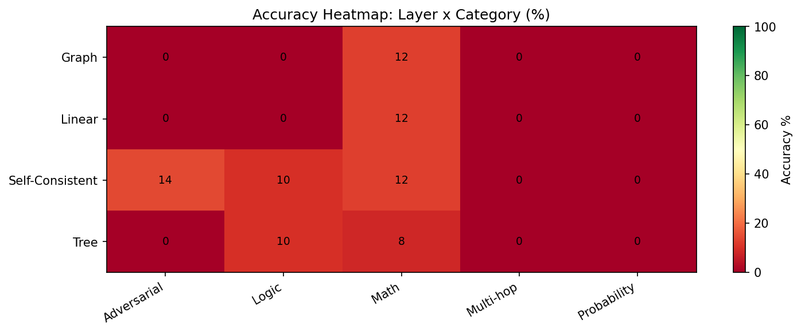
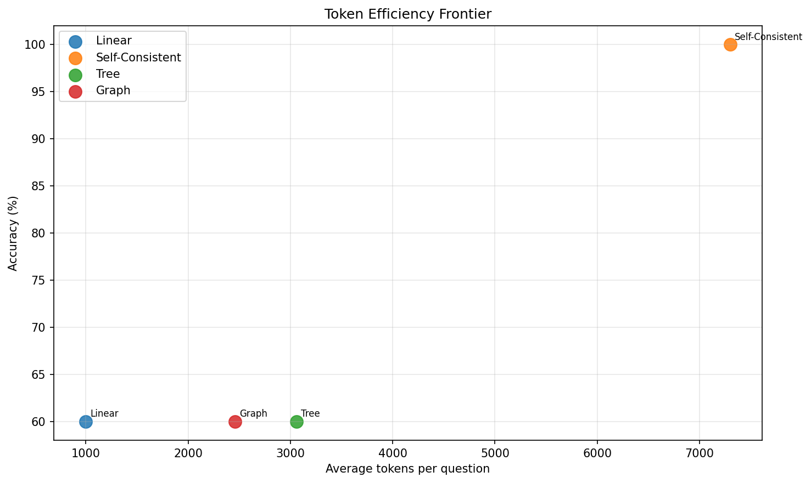
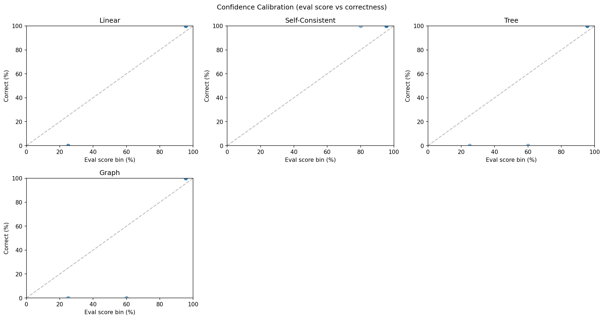

# EDI2 Reasoning Layer Evaluation Framework

It is research framework for comparing different reasoning strategies on the same language model, question set, evaluator, and analysis pipeline. The project wraps an OpenRouter chat model with multiple reasoning layers, runs controlled evaluations, saves structured JSON results, and generates publication-oriented visualizations.

The current codebase supports six reasoning layers:

- Linear
- Self-Consistent
- Tree
- Graph
- MCTS
- Hybrid Tree plus Self-Consistent

The most recent saved run in this workspace is:

```text
eval/results_gemini_meta_llama_llama_3_3_70b_instruct.json
```

That run used:

```text
Model: meta-llama/llama-3.3-70b-instruct
Judge: heuristics
Questions: 10
Layers: Linear, Self-Consistent, Tree, Graph
Flags: --limit 10 --no-mcts --no-hybrid --resume
```

## Contents

1. [Project Purpose](#project-purpose)
2. [Repository Layout](#repository-layout)
3. [Environment Setup](#environment-setup)
4. [PowerShell Quick Start](#powershell-quick-start)
5. [Model and API Configuration](#model-and-api-configuration)
6. [System Architecture](#system-architecture)
7. [Reasoning Layer Interface](#reasoning-layer-interface)
8. [Reasoning Layers](#reasoning-layers)
9. [Evaluation Pipeline](#evaluation-pipeline)
10. [Dataset](#dataset)
11. [Current Results](#current-results)
12. [Analysis and Visualization](#analysis-and-visualization)
13. [Output Files](#output-files)
14. [Result JSON Schema](#result-json-schema)
15. [Manual Error Analysis](#manual-error-analysis)
16. [Troubleshooting](#troubleshooting)
17. [Research Extensions](#research-extensions)

## Project Purpose

The purpose of this project is to compare how reasoning architecture changes answer quality, token cost, latency, and failure mode for the same base model.

The framework is built around a controlled experiment:

1. Use a shared question bank from `eval/questions.py`.
2. Send each question through one or more reasoning layers.
3. Evaluate each predicted answer against the gold answer.
4. Save per-layer and per-question metadata to JSON.
5. Generate visualizations and reports from the saved result file.

This lets the project answer research questions such as:

- Does self-consistency improve accuracy enough to justify its token cost?
- Does tree search help on multi-step math or does it create noisy branches?
- Does graph decomposition help on multi-hop questions?
- Which layer gives the best accuracy per token?
- Which categories fail most often?
- Are evaluator scores calibrated with actual correctness?
- Are observed differences meaningful, or just noise from a small sample?

## Repository Layout

```text
edi2/
  .env.example
  .gitignore
  base_llm.py
  main.py
  README.md
  requirements.txt
  test_phase1.py

  reasoning/
    base.py
    graph.py
    hybrid.py
    linear.py
    llm_utils.py
    mcts.py
    self_consistent.py
    tree.py

  eval/
    analysis.py
    check_quota.py
    evaluator.py
    questions.py
    runner_improved.py
    results_gemini_meta_llama_llama_3_3_70b_instruct.json
    results_improved_llama_3_3_70b_versatile.json

    figures/
      analysis_summary.txt
      confidence_calibration.png
      efficiency_frontier.png
      heatmap_layer_category.png
      statistical_significance.txt
```

Important files:

| File | Purpose |
|---|---|
| `base_llm.py` | OpenRouter client wrapper, model constants, retries, token accounting, quota errors |
| `main.py` | Single-question demo that runs all six reasoning layers |
| `test_phase1.py` | Local validation for imports, evaluator behavior, dataset loading, and optional API call |
| `reasoning/base.py` | Abstract `ReasoningLayer` interface shared by all layers |
| `reasoning/linear.py` | Step-by-step reasoning with contradiction checks and reflection |
| `reasoning/self_consistent.py` | Multiple independent chains with quality-weighted clustered voting |
| `reasoning/tree.py` | Branching search with LLM scoring and pruning |
| `reasoning/graph.py` | Sub-question graph decomposition with dependency ordering and consistency checks |
| `reasoning/mcts.py` | Monte Carlo Tree Search over reasoning steps |
| `reasoning/hybrid.py` | Tree exploration followed by self-consistent voting |
| `reasoning/llm_utils.py` | Shared score parsing and answer normalization helpers |
| `eval/questions.py` | 55-question benchmark dataset |
| `eval/evaluator.py` | Correctness evaluator using numeric, keyword, form, and optional LLM judge strategies |
| `eval/runner_improved.py` | Main benchmark runner with resume support |
| `eval/analysis.py` | Plot and report generator |

## Environment Setup

The project is written for Python and uses OpenRouter through the OpenAI-compatible SDK.

Install dependencies:

```powershell
python -m pip install -r requirements.txt
```

The dependency file currently includes:

```text
openai>=1.40.0
python-dotenv>=1.0.0
matplotlib>=3.8.0
numpy>=1.26.0
```

Create a `.env` file in the project root:

```text
OPENROUTER_API_KEY=your_key_here
```

Optional OpenRouter metadata:

```text
OPENROUTER_REFERER=http://localhost
OPENROUTER_APP_NAME=edi2-reasoning
```

The API key is read with `dotenv` through `find_dotenv()`, so commands can be run from the project root without manually exporting environment variables.

## PowerShell Quick Start

All commands below assume the working directory is:

```powershell
cd "C:\Users\AARUSHI TANDON\OneDrive\Python\edi2"
```

Install dependencies:

```powershell
python -m pip install -r requirements.txt
```

Run local validation:

```powershell
python test_phase1.py
```

Run the single-question demo:

```powershell
python main.py
```

Run the same 10-question evaluation that produced the current saved results:

```powershell
python eval/runner_improved.py --limit 10 --no-mcts --no-hybrid --resume
```

Run analysis for the current saved result file:

```powershell
python eval/analysis.py --results eval/results_gemini_meta_llama_llama_3_3_70b_instruct.json
```

Open the generated files:

```powershell
Get-ChildItem eval\figures
```

If `python eval/analysis.py` is run without `--results`, it looks for the default file:

```text
eval/results_improved.json
```

If that file does not exist, pass the actual saved result file explicitly:

```powershell
python eval/analysis.py --results eval/results_gemini_meta_llama_llama_3_3_70b_instruct.json
```

## Model and API Configuration

Model constants live in `base_llm.py`.

| Constant | Value | Used for |
|---|---|---|
| `OPENROUTER_BASE_URL` | `https://openrouter.ai/api/v1` | OpenAI-compatible API endpoint |
| `SMART_MODEL` | `meta-llama/llama-3.3-70b-instruct` | Default reasoning model |
| `EVAL_MODEL` | `meta-llama/llama-3.1-8b-instruct` | Fast model, MCTS rollout, MCTS expansion |
| `JUDGE_MODEL` | `meta-llama/llama-3.1-8b-instruct` | Optional LLM-as-judge |
| `ACTIVE_MODEL` | `SMART_MODEL` | Default model for `BaseLLM` |
| `TEMPERATURE` | `0.7` | Default generation temperature |
| `JUDGE_TEMP` | `0.3` | Lower temperature for judge scoring |
| `MAX_TOKENS` | `1024` | Maximum tokens per completion |
| `MAX_RETRIES` | `6` | Retry attempts for recoverable API failures |
| `BACKOFF_BASE` | `2` | Exponential backoff base |
| `MAX_WAIT_SECONDS` | `90` | Maximum wait between retries |

`BaseLLM.call(prompt, model=None)` performs one chat completion. If `model` is passed, the call uses that model for only that request. This is how MCTS can use a cheaper model for expansion and rollout while the main experiment still has a primary model.

`BaseLLM` tracks:

- `call_count`
- `token_count`
- `raw_outputs`
- `model_name`

Each reasoning layer calls `self.llm.reset_stats()` at the start of `solve()`, so the result stats describe that one solve call.

Quota and rate-limit handling:

- Authentication errors are surfaced immediately.
- Quota, credit, daily token, and 429-style errors raise `LLMQuotaExceeded`.
- Recoverable errors retry with exponential backoff.
- The runner checkpoints after every layer-question pair, so partial work is preserved.

## System Architecture

The runtime flow is:

```text
Question bank
  |
  v
eval/runner_improved.py
  |
  +-- builds BaseLLM
  +-- builds selected reasoning layers
  +-- sends each question to each layer
  +-- evaluates each answer with CorrectnesEvaluator
  +-- saves checkpoint JSON after each completed run
  |
  v
eval/results_*.json
  |
  v
eval/analysis.py
  |
  +-- heatmap_layer_category.png
  +-- efficiency_frontier.png
  +-- confidence_calibration.png
  +-- statistical_significance.txt
  +-- analysis_summary.txt
```

The project separates four concerns:

| Concern | Module |
|---|---|
| Model transport and retry logic | `base_llm.py` |
| Reasoning strategy | `reasoning/*.py` |
| Correctness scoring | `eval/evaluator.py` |
| Research reporting | `eval/analysis.py` |

This separation makes it possible to compare layers without changing the dataset, model wrapper, or evaluator.

## Reasoning Layer Interface

All reasoning layers inherit from `ReasoningLayer` in `reasoning/base.py`.

Every layer implements:

```python
solve(question: str) -> dict
```

Every returned dictionary must include at least:

```python
{
    "answer": str,
    "steps": list[str],
    "stats": {
        "llm_calls": int,
        "total_tokens": int,
        "model": str,
    },
}
```

Shared helper methods:

| Method | Purpose |
|---|---|
| `_build_step_prompt(question, steps_so_far)` | Creates a step-by-step prompt containing prior reasoning |
| `_extract_final_answer(text)` | Extracts text after `Final Answer:` |

The runner relies on the common return structure to collect tokens, calls, wall-clock time, and final answers in a uniform way.

## Reasoning Layers

This section explains the reasoning layers at two levels:

- Simple explanation: what the layer is trying to do in plain language.
- Technical explanation: the research mechanism behind the layer, without relying on code details.

Each layer is a different way of controlling how the model thinks before it gives an answer. The model itself is still the same OpenRouter model. What changes is the structure around the model: whether it thinks once, thinks many times, explores branches, decomposes the problem, searches with rewards, or combines methods.

### Linear

File:

```text
reasoning/linear.py
```

Default constants:

```text
MAX_STEPS = 8
enable_contradiction_check = True
enable_reflection = True
```

Linear reasoning generates one step at a time. Each new prompt includes the question and all previously accepted steps.

Simple explanation:

Linear reasoning is the most direct strategy. It asks the model to solve the problem step by step in one continuous line. After each step, the layer checks whether the new step fits with the earlier steps. At the end, it asks the model to review its own work and correct the final answer if needed.

Technical explanation:

This layer is a sequential chain-of-thought controller with two verification mechanisms. The first mechanism is contradiction detection, where a new step is checked against the accumulated reasoning history. If the step conflicts with earlier reasoning, the layer backtracks and tries again with consistency guidance. The second mechanism is reflection, where the complete reasoning chain is reviewed before the final answer is accepted. The layer also estimates per-step confidence, which gives a rough internal signal for how reliable the reasoning path appears.

For each generated step:

1. The layer asks the model for the next reasoning step.
2. If previous steps exist, it checks whether the new step contradicts them.
3. If a contradiction is detected, it removes the previous step and retries with consistency guidance.
4. It asks the model to score the step's logical validity from 1 to 10.
5. It stops early if the step contains `Final Answer:`.
6. At the end, it performs a reflection pass that can correct the final answer.

Extra outputs:

| Field | Meaning |
|---|---|
| `step_scores` | Per-step confidence scores from 1 to 10 |
| `avg_confidence` | Mean of `step_scores` |
| `backtrack_count` | Number of contradiction-triggered backtracks |

Strengths:

- Simple and easy to inspect.
- Lower cost than ensemble methods.
- Reflection can catch some local mistakes.
- Good baseline for measuring whether more complex reasoning layers actually help.

Weaknesses:

- Early mistakes can influence later steps.
- Contradiction checking adds extra calls.
- It explores only one reasoning path.
- It can sound confident even when the first setup is wrong.

### Self-Consistent

File:

```text
reasoning/self_consistent.py
```

Default constants:

```text
N_CHAINS = 8
OUTLIER_QUALITY_THRESHOLD = 3.0
```

Self-Consistent reasoning generates multiple independent answers, scores each chain, removes low-quality outliers, clusters answer variants, and selects the strongest answer cluster.

Simple explanation:

Self-Consistent reasoning asks the model to solve the same question several times independently. Instead of trusting one answer, it compares the answers, groups similar ones together, and chooses the answer group with the strongest support. It is similar to asking several people to solve the same problem and choosing the most reliable consensus.

Technical explanation:

This layer is an ensemble method. It samples multiple reasoning trajectories from the same model, then performs answer extraction, quality scoring, outlier filtering, answer normalization, clustering, and weighted voting. The key idea is that individual generations may be noisy, but repeated independent generations can reveal a more stable answer. The weighted voting stage prevents a low-quality chain from counting as strongly as a coherent chain.

Pipeline:

1. Generate `N_CHAINS` independent reasoning chains.
2. For each chain, ask the model to extract only the final answer.
3. Ask the model to score the chain's logical coherence from 1 to 10.
4. Drop chains with quality score below `3.0`.
5. Normalize answers for clustering.
6. Cluster answers with string similarity threshold `0.85`.
7. Select the cluster with the highest total quality score.

Answer normalization is implemented in `reasoning/llm_utils.py`.

It handles:

- Case normalization
- Punctuation cleanup
- Number extraction
- Fraction conversion
- Number words such as `six hundred`

Extra outputs:

| Field | Meaning |
|---|---|
| `chains` | All generated chains, extracted answers, and quality scores |
| `clusters` | Grouped answers with weights |
| `outliers_dropped` | Number of low-quality chains excluded from voting |

Strengths:

- Reduces dependence on one sample.
- Can recover when some chains fail.
- Useful for math and short-answer questions where answer clustering is meaningful.
- Provides a natural way to measure answer stability across samples.

Weaknesses:

- High token cost.
- All chains can share the same misconception.
- Requires answer extraction and clustering to behave well.
- It is less useful when correct answers are long, open-ended, or hard to cluster.

### Tree

File:

```text
reasoning/tree.py
```

Default constants:

```text
MAX_DEPTH = 4
BRANCH_COUNT = 3
TOP_K = 2
MIN_DEPTH = 3
EARLY_EXIT_THRESHOLD = 8.5
UCB_C = 1.41
```

Tree reasoning explores multiple candidate next steps at each depth.

Simple explanation:

Tree reasoning does not follow only one path. At each point, it asks the model for several possible next steps, scores those options, keeps the strongest ones, and discards weaker ones. It is like exploring a few possible solution paths before deciding which path deserves more attention.

Technical explanation:

This layer is a beam-style search over reasoning states. A branch represents a partial reasoning path. At every depth, the layer expands active branches into multiple candidate continuations, assigns each continuation a model-based score, and keeps only the highest-scoring branches. This gives the system controlled exploration without allowing the number of branches to grow uncontrollably. The early-exit rule allows the layer to stop when a high-scoring branch already contains a final answer.

Pipeline:

1. Start with one empty branch.
2. At each depth, ask the model to generate `BRANCH_COUNT` different next-step options.
3. Score every candidate from 1 to 10 for logical validity and progress.
4. Keep the top `TOP_K` candidates by cumulative score.
5. After `MIN_DEPTH`, allow candidates to include `Final Answer:`.
6. If a candidate has score at least `8.5` and contains a final answer, return it immediately.
7. If no final answer is found, use the best surviving branch for a fallback final-answer prompt.

Extra outputs:

| Field | Meaning |
|---|---|
| `early_exit` | Whether the layer returned during high-confidence branch expansion |
| `exit_score` | Score that caused early exit, when applicable |
| `tree_structure` | Placeholder structure for future visualization |

Strengths:

- Explores alternatives rather than committing to one path.
- Can prune weaker branches.
- Provides branch-level scores for analysis.
- Useful when there are multiple plausible solution routes.

Weaknesses:

- Branch generation and scoring are expensive.
- LLM self-scoring can prefer plausible wrong steps.
- The current runner saves final result metadata, not full branch structures.
- If the scoring signal is weak, pruning can remove the correct path too early.

### Graph

File:

```text
reasoning/graph.py
```

Default constant:

```text
MAX_NODES = 8
```

Graph reasoning decomposes the original question into atomic sub-questions, infers dependencies between them, resolves the dependency graph, and checks consistency.

Simple explanation:

Graph reasoning breaks a problem into smaller questions. It then figures out which smaller questions must be answered first, solves them in order, and combines the answers to solve the original question. This is useful when a problem has several facts or calculations that depend on each other.

Technical explanation:

This layer treats reasoning as a dependency graph. Each node is an atomic sub-problem, and edges describe which sub-problems depend on earlier results. The layer performs decomposition, dependency inference, cycle handling, ordering, node resolution, final synthesis, and consistency validation. The goal is to make intermediate facts explicit and to prevent the model from mixing unresolved assumptions into the final answer.

Pipeline:

1. Decompose the problem into 3 to 4 nodes.
2. Ask the model which node IDs depend on which other node IDs.
3. Detect cycles using DFS.
4. Break cycles by removing cycle-internal dependencies from one node.
5. Topologically order nodes.
6. Prioritize high fan-in nodes when possible.
7. Resolve nodes using answers from dependencies as context.
8. Ask whether the resolved facts are enough to answer the original question.
9. If not enough, generate one new needed sub-question.
10. Stop when a final answer is available or `MAX_NODES` is reached.
11. Run a consistency validation pass.
12. If problem nodes are identified, re-resolve them.
13. If no final answer exists, run a fallback final-answer prompt using all facts.

Extra outputs:

| Field | Meaning |
|---|---|
| `graph` | List of resolved node dictionaries |
| `is_consistent` | Result of the consistency validation pass |

Strengths:

- Good fit for multi-hop reasoning.
- Makes intermediate facts explicit.
- Can identify dependency issues and re-resolve nodes.
- Makes it easier to inspect where a complex answer came from.

Weaknesses:

- Dependency inference is itself model-generated.
- Decomposition can introduce unnecessary or wrong sub-questions.
- Current consistency validation is still an LLM judgment.
- It can overcomplicate simple problems by creating unnecessary nodes.

### MCTS

File:

```text
reasoning/mcts.py
```

Default constants:

```text
DEFAULT_ITERATIONS = 4
DEFAULT_EXPAND_K = 2
UCB_C = 1.41
max_depth = 8
rollout_model = EVAL_MODEL
expand_model = EVAL_MODEL
```

MCTS stands for Monte Carlo Tree Search. This layer treats reasoning steps as nodes in a search tree.

Simple explanation:

MCTS reasoning repeatedly explores possible reasoning paths, gives each explored path a reward, and then spends more effort on paths that look promising while still occasionally exploring less-tested paths. It is a more formal search strategy than Tree reasoning.

Technical explanation:

This layer adapts Monte Carlo Tree Search to language reasoning. A node represents a partial reasoning state. The search alternates between selection, expansion, simulation, scoring, and backpropagation. Selection uses the UCB rule to balance exploitation of high-reward paths with exploration of under-tested paths. Simulation rolls a partial path forward until an answer is produced, and scoring estimates the quality of that rollout. Backpropagation updates the value estimates of all nodes along the selected path.

Each iteration follows:

1. Select a leaf using UCB.
2. Expand the leaf by generating `expand_k` candidate next steps.
3. Simulate from one expanded child using the rollout model.
4. Extract or produce a final answer.
5. Score the rollout from 1 to 10.
6. Convert the score to reward from 0.0 to 1.0.
7. Backpropagate the reward through parent nodes.

The UCB formula balances exploitation and exploration:

```text
ucb = average_reward + c * sqrt(log(parent_visits + 1) / visits)
```

Extra outputs:

| Field | Meaning |
|---|---|
| `mcts_log` | Per-iteration depth, reward, and answer trace |
| `best_reward` | Highest rollout reward observed |
| `iterations` | Number of MCTS iterations |
| `nodes_explored` | Count of nodes in the search tree |

Strengths:

- Formal exploration and exploitation mechanism.
- Can use a cheaper model for rollout and expansion.
- Produces useful search metadata.
- Better suited than simple Tree search when repeated exploration is valuable.

Weaknesses:

- High cost as iterations increase.
- Reward is still model-scored rather than ground-truth scored during inference.
- Not included in the current 10-question saved run because it was skipped with `--no-mcts`.
- Low-quality reward estimates can mislead the search.

### Hybrid

File:

```text
reasoning/hybrid.py
```

Default parameters:

```text
tree_depth = 3
n_chains = 5
branch_count = 2
```

The runner currently builds Hybrid with:

```text
n_chains = 4
```

Hybrid combines Tree and Self-Consistent reasoning.

Simple explanation:

Hybrid reasoning first uses Tree search to find a strong starting path, then uses Self-Consistent reasoning to generate several final answers from that path. It is designed to combine exploration with consensus.

Technical explanation:

This layer is a staged composition of two reasoning mechanisms. The Tree phase searches for a promising reasoning prefix. The voting phase then treats that prefix as shared context and generates multiple continuations. The final answer is selected through quality-weighted answer clustering. The purpose is to reduce the weaknesses of both parent methods: Tree search can find a structured direction, while self-consistency can reduce final-answer variance.

Pipeline:

1. Run a shallow Tree search.
2. Extract the best tree prefix.
3. Generate several independent continuation chains from that prefix.
4. Extract final answers.
5. Score chain quality.
6. Cluster answers.
7. Select the highest-weighted answer cluster.

Extra outputs:

| Field | Meaning |
|---|---|
| `tree_answer` | Answer produced by the Tree phase |
| `chains` | Continuation chains from the selected prefix |
| `clusters` | Weighted answer clusters |

Strengths:

- Uses Tree search to find a promising prefix.
- Uses voting to reduce single-path fragility.
- Useful as a high-cost, high-robustness layer.

Weaknesses:

- Usually the most expensive layer.
- If the tree prefix is bad, all continuation chains inherit that context.
- Not included in the current 10-question saved run because it was skipped with `--no-hybrid`.

### Verifier-Guided

Status:

```text
Proposed research layer, not currently implemented in the codebase.
```

Simple explanation:

Verifier-Guided reasoning would separate solving from checking. One model pass would generate a candidate answer, and another verification process would test whether the answer actually follows from the problem. If the verification fails, the system would revise the solution and verify again before returning the final answer.

Technical explanation:

This layer would use a generator-verifier architecture. The generator produces a reasoning chain and candidate answer. The verifier evaluates the candidate against explicit criteria such as arithmetic validity, constraint satisfaction, premise coverage, contradiction checks, and final-answer format. A revision loop would continue until the verifier accepts the answer or a maximum number of attempts is reached. Unlike simple reflection, the verifier would be a separate stage with a structured checklist and a clear reject or accept decision.

Expected pipeline:

1. Generate an initial reasoning chain and answer.
2. Extract the final answer and important intermediate claims.
3. Verify whether each intermediate claim follows from the question.
4. Verify whether calculations or logical transitions are valid.
5. Verify whether the final answer satisfies the exact question asked.
6. If verification fails, produce targeted feedback.
7. Regenerate or revise only the flawed part of the reasoning.
8. Return the answer only after verification passes or the retry budget is exhausted.

Expected outputs:

| Field | Meaning |
|---|---|
| `answer` | Final verified answer |
| `verification_passed` | Whether the verifier accepted the final attempt |
| `verification_notes` | Short explanation of accepted or rejected claims |
| `revision_count` | Number of correction attempts |
| `failed_checks` | Checklist items that failed during verification |

Strengths:

- Separates answer generation from answer validation.
- Can catch arithmetic, constraint, and prompt-misreading errors.
- Produces cleaner error analysis because failed checks are explicit.
- Useful for high-stakes or multi-condition questions where correctness needs justification.

Weaknesses:

- Adds extra model calls.
- The verifier can still be wrong if it relies only on LLM judgment.
- Needs a well-designed checklist for each problem type.
- May over-reject valid answers when formatting or wording differs.

Why it would be useful for this project:

The current layers often rely on the same model to both reason and self-score. A Verifier-Guided layer would make the checking step more explicit and structured. It would be especially useful for the current failure cases where the final answer is plausible but wrong, such as rate problems, probability problems, and multi-step arithmetic.

## Evaluation Pipeline

The main evaluation script is:

```text
eval/runner_improved.py
```

Basic command:

```powershell
python eval/runner_improved.py
```

Important flags:

| Flag | Purpose |
|---|---|
| `--model <model>` | Use a specific OpenRouter model |
| `--fast` | Use `EVAL_MODEL` for all layers |
| `--judge` | Enable LLM-as-judge correctness scoring |
| `--limit <n>` | Run only the first `n` filtered questions |
| `--category <name>` | Filter questions by category |
| `--difficulty <level>` | Filter questions by difficulty |
| `--no-mcts` | Skip the MCTS layer |
| `--no-hybrid` | Skip the Hybrid layer |
| `--mcts-iters <n>` | Set MCTS iterations |
| `--output <path>` | Save results to a custom file |
| `--resume` | Load existing JSON and skip completed layer-question pairs |

Examples:

Run first 10 questions without MCTS or Hybrid:

```powershell
python eval/runner_improved.py --limit 10 --no-mcts --no-hybrid
```

Resume the same run:

```powershell
python eval/runner_improved.py --limit 10 --no-mcts --no-hybrid --resume
```

Run only math questions:

```powershell
python eval/runner_improved.py --category Math --no-mcts --no-hybrid
```

Run only hard questions:

```powershell
python eval/runner_improved.py --difficulty hard --no-mcts --no-hybrid
```

Use the fast model:

```powershell
python eval/runner_improved.py --fast --limit 10 --no-mcts --no-hybrid
```

Use LLM judge scoring:

```powershell
python eval/runner_improved.py --limit 10 --judge --no-mcts --no-hybrid
```

Run all six layers with a small MCTS budget:

```powershell
python eval/runner_improved.py --limit 10 --mcts-iters 4
```

Save to a custom file:

```powershell
python eval/runner_improved.py --limit 10 --no-mcts --no-hybrid --output eval/my_run.json
```

The runner saves after every completed layer-question pair. This is important because long runs can hit rate limits. If a run stops, use the same command with `--resume`.

## Correctness Evaluation

Correctness is handled by `CorrectnesEvaluator` in `eval/evaluator.py`.

The evaluator applies strategies in this order:

1. Numeric tolerance
2. Keyword match
3. Form variation
4. Optional LLM judge
5. Keyword fallback

### Numeric Tolerance

The evaluator extracts the first number from the predicted answer and the first number from the expected answer.

Tolerance:

```text
max(abs(expected) * 0.01, 0.01)
```

This means numeric answers can be within 1 percent, or within 0.01 for very small values.

Example:

```text
Predicted: 6331
Expected: 6341
Tolerance: 63.41
Result: correct
```

### Keyword Match

The evaluator lowercases both strings, splits the expected answer into keywords longer than two characters, and checks how many expected keywords appear in the prediction.

Threshold:

```text
correct if score >= 0.8
```

This is useful for short logic answers but can be fragile for paraphrases.

### Form Variation

The evaluator normalizes answer forms by:

- Lowercasing
- Normalizing whitespace
- Treating separators similarly
- Removing common stopwords
- Comparing simple string similarity

Threshold:

```text
correct if score > 0.85
```

### LLM Judge

The LLM judge is used only when `--judge` is passed.

It prompts the judge model with:

- Original question
- Category
- Expected answer
- Predicted answer

The judge returns:

```text
SCORE: <number>
REASON: <brief explanation>
```

The runner treats the answer as correct when:

```text
score >= 0.75
```

## Dataset

The benchmark dataset is defined in:

```text
eval/questions.py
```

Total questions:

```text
55
```

Each question has:

| Field | Meaning |
|---|---|
| `id` | Stable ID such as `Q0` |
| `category` | Problem category |
| `difficulty` | `easy`, `medium`, or `hard` |
| `question` | Natural-language prompt |
| `answer` | Gold answer |
| `source` | Source or style tag |

Category counts:

| Category | Count |
|---|---:|
| Math | 24 |
| Logic | 10 |
| Multi-hop | 7 |
| Adversarial | 7 |
| Probability | 7 |

Difficulty counts:

| Difficulty | Count |
|---|---:|
| Easy | 11 |
| Medium | 30 |
| Hard | 14 |

Category by difficulty:

| Category | Easy | Medium | Hard | Total |
|---|---:|---:|---:|---:|
| Math | 5 | 13 | 6 | 24 |
| Logic | 2 | 6 | 2 | 10 |
| Multi-hop | 1 | 4 | 2 | 7 |
| Adversarial | 1 | 3 | 3 | 7 |
| Probability | 2 | 4 | 1 | 7 |

Example questions:

| ID | Category | Difficulty | Answer |
|---|---|---|---|
| Q0 | Math | medium | `600` |
| Q1 | Math | medium | `6341` |
| Q2 | Math | medium | `15` |
| Q7 | Adversarial | hard | `$0.05` |

To add questions, append dictionaries to `QUESTIONS` using the same schema.

## Current Results

The current saved result file is:

```text
eval/results_gemini_meta_llama_llama_3_3_70b_instruct.json
```

It was produced by a 10-question run with MCTS and Hybrid skipped:

```powershell
python eval/runner_improved.py --limit 10 --no-mcts --no-hybrid --resume
```

Accuracy summary:

| Layer | Correct | Accuracy | Total Tokens | Avg Tokens per Question | Total Time | Avg Time per Question |
|---|---:|---:|---:|---:|---:|---:|
| Linear | 8/10 | 80.0% | 17,583 | 1,758 | 226.0s | 22.6s |
| Self-Consistent | 7/10 | 70.0% | 74,456 | 7,446 | 1000.9s | 100.1s |
| Tree | 5/10 | 50.0% | 39,996 | 4,000 | 461.5s | 46.1s |
| Graph | 7/10 | 70.0% | 57,206 | 5,721 | 1204.3s | 120.4s |

Per-category correctness in the current 10-question run:

| Layer | Adversarial | Logic | Math | Multi-hop | Probability |
|---|---:|---:|---:|---:|---:|
| Linear | 1/1 | 2/2 | 4/5 | 1/1 | 0/1 |
| Self-Consistent | 1/1 | 2/2 | 3/5 | 1/1 | 0/1 |
| Tree | 1/1 | 2/2 | 1/5 | 1/1 | 0/1 |
| Graph | 1/1 | 2/2 | 3/5 | 1/1 | 0/1 |

Observed from this run:

- Linear had the highest accuracy and lowest token cost among the four tested layers.
- Self-Consistent and Graph tied on accuracy, but Self-Consistent used fewer total seconds than Graph in this run.
- Tree performed poorly on the math subset in this specific sample.
- All layers failed Q9, the probability question.
- All layers failed Q8, the train timing question.
- The sample is small, so confidence intervals are wide.

## Analysis and Visualization

The analysis script is:

```text
eval/analysis.py
```

Run analysis for the current saved result file:

```powershell
python eval/analysis.py --results eval/results_gemini_meta_llama_llama_3_3_70b_instruct.json
```

Generated files:

```text
eval/figures/heatmap_layer_category.png
eval/figures/efficiency_frontier.png
eval/figures/confidence_calibration.png
eval/figures/statistical_significance.txt
eval/figures/analysis_summary.txt
```

### Accuracy Heatmap

Path:

```text
eval/figures/heatmap_layer_category.png
```

Rendered figure:



What it shows:

- Rows are reasoning layers.
- Columns are problem categories.
- Each cell is accuracy percentage.
- The color scale runs from low accuracy to high accuracy.

Technical source:

```text
plot_heatmap(results, out_path)
```

The function reads the result JSON, groups by layer and question category, computes percent correct, and saves a PNG with `matplotlib`.

### Token Efficiency Frontier

Path:

```text
eval/figures/efficiency_frontier.png
```

Rendered figure:



What it shows:

- X-axis is average tokens per question.
- Y-axis is accuracy percentage.
- Each point is one reasoning layer.
- Better layers appear toward the upper-left: higher accuracy and lower token cost.

Technical source:

```text
plot_efficiency_frontier(results, out_path)
```

The function sums tokens and correctness for each layer, computes average tokens per question, and plots accuracy against cost.

### Confidence Calibration

Path:

```text
eval/figures/confidence_calibration.png
```

Rendered figure:



What it shows:

- Each subplot is one layer.
- X-axis is evaluator score bin.
- Y-axis is actual correctness.
- The dashed diagonal is ideal calibration.

Technical source:

```text
plot_confidence_calibration(results, out_path)
```

The current evaluator often outputs scores near 0 or 1 for heuristic matches, so this plot is most informative when there are more examples and when `--judge` is used.

### Statistical Significance Report

Path:

```text
eval/figures/statistical_significance.txt
```

Current report summary:

```text
Graph                70.0%  [95% CI: 41.6% - 98.4%]  (7/10)
Linear               80.0%  [95% CI: 55.2% - 104.8%]  (8/10)
Self-Consistent      70.0%  [95% CI: 41.6% - 98.4%]  (7/10)
Tree                 50.0%  [95% CI: 19.0% - 81.0%]  (5/10)
```

The current implementation uses a normal approximation:

```text
p +/- 1.96 * sqrt(p * (1 - p) / n)
```

Because `n = 10`, the intervals are very wide. Some upper bounds can exceed 100 percent because the current script does not clamp the interval to `[0, 100]`.

### Analysis Summary

Path:

```text
eval/figures/analysis_summary.txt
```

This file lists generated figures and includes the beginning of the statistical report.

## Output Files

### Evaluation Result Files

The runner default output name is based on the model:

```python
safe = model.replace(".", "_").replace("-", "_").replace("/", "_")
return f"eval/results_gemini_{safe}.json"
```

For the default model:

```text
meta-llama/llama-3.3-70b-instruct
```

The output path becomes:

```text
eval/results_gemini_meta_llama_llama_3_3_70b_instruct.json
```

### Figure Files

All analysis outputs are written to:

```text
eval/figures/
```

The plot files are overwritten each time `eval/analysis.py` runs.

## Result JSON Schema

The saved JSON is keyed by layer name, then question ID.

Structure:

```json
{
  "Linear": {
    "Q0": {
      "answer": "600",
      "correct": true,
      "score": 1.0,
      "confidence": "high",
      "strategy": "numeric_tolerance",
      "reason": "Numeric match: 600.0 vs 600.0 (tolerance: ...)",
      "tokens": 1863,
      "calls": 6,
      "time_s": 18.4,
      "category": "Math",
      "difficulty": "medium"
    }
  }
}
```

Field meanings:

| Field | Type | Meaning |
|---|---|---|
| `answer` | string | Final answer returned by the reasoning layer, truncated to 200 chars by the runner |
| `correct` | boolean | Evaluator correctness result |
| `score` | float | Evaluator score from 0.0 to 1.0 |
| `confidence` | string | Evaluator confidence label |
| `strategy` | string | Evaluation strategy used |
| `reason` | string | Short explanation from evaluator |
| `tokens` | integer | Total tokens recorded by `BaseLLM` for this solve |
| `calls` | integer | Number of LLM calls for this solve |
| `time_s` | float | Wall-clock solve time in seconds |
| `category` | string | Question category |
| `difficulty` | string | Question difficulty |

Note that the result JSON currently stores evaluation metadata but not the complete layer internals. For example, Tree returns `tree_structure` from `solve()`, and Graph returns `graph`, but `runner_improved.py` does not currently save those full fields in the final JSON.

## Manual Error Analysis

The project already generates aggregate plots, but manual error analysis is still needed for research-quality interpretation.

Recommended process:

1. Open the result JSON.
2. For each layer, find entries where `correct` is `false`.
3. Read the original question from `eval/questions.py`.
4. Compare the predicted answer with the gold answer.
5. Assign a failure category.

Suggested failure categories:

| Category | Description |
|---|---|
| Arithmetic error | Reasoning structure was right, calculation was wrong |
| Algebra setup error | Equation or rate relationship was built incorrectly |
| Misread prompt | Model ignored or changed a condition |
| Premature final answer | Model stopped before enough information was derived |
| Bad branch selection | Tree or MCTS selected a plausible but wrong path |
| Bad decomposition | Graph created unhelpful or wrong sub-questions |
| Dependency error | Graph resolved nodes in a poor dependency order |
| Voting collapse | Self-Consistent chains agreed on the same wrong answer |
| Evaluator issue | Prediction may be valid, but heuristic scoring failed |
| Formatting issue | Answer was right but not in a form the evaluator recognized |

For the current 10-question run, good first targets are:

| Question | Notes |
|---|---|
| Q8 | All four tested layers were wrong on the train timing problem |
| Q9 | All four tested layers gave `31/105` for the probability problem |
| Q6 | Tree and Graph failed while Linear and Self-Consistent passed |
| Q1 | Self-Consistent and Tree failed while Linear and Graph passed |
| Q2 | Tree failed while the other three tested layers passed |

## Troubleshooting

### Analysis says results file was not found

If this command is run:

```powershell
python eval/analysis.py
```

The script looks for:

```text
eval/results_improved.json
```

Use the actual result path:

```powershell
python eval/analysis.py --results eval/results_gemini_meta_llama_llama_3_3_70b_instruct.json
```

### `ModuleNotFoundError: No module named 'matplotlib'`

Install dependencies:

```powershell
python -m pip install -r requirements.txt
```

If needed, install plotting packages directly:

```powershell
python -m pip install matplotlib numpy
```

Verify:

```powershell
python -c "import matplotlib, numpy; print(matplotlib.__version__, numpy.__version__)"
```

### API key missing

If the runner prints:

```text
ERROR: OPENROUTER_API_KEY not set in .env
```

Create `.env` in the repository root:

```text
OPENROUTER_API_KEY=your_key_here
```

### Rate limits or quota errors

The runner saves progress after each completed layer-question pair. When quota resets, rerun the same command with `--resume`.

Example:

```powershell
python eval/runner_improved.py --limit 10 --no-mcts --no-hybrid --resume
```

To reduce cost:

```powershell
python eval/runner_improved.py --fast --limit 10 --no-mcts --no-hybrid --resume
```

### MCTS is expensive

MCTS uses repeated expansion and rollout calls. Reduce iterations:

```powershell
python eval/runner_improved.py --limit 10 --mcts-iters 2
```

Or skip it:

```powershell
python eval/runner_improved.py --limit 10 --no-mcts
```

### Hybrid is expensive

Hybrid runs Tree first, then multiple continuation chains. Skip it during development:

```powershell
python eval/runner_improved.py --limit 10 --no-hybrid
```

### Current confidence intervals look strange

The statistical report uses a normal approximation and does not clamp bounds. With only 10 questions, intervals are wide and can exceed 100 percent. This is expected from the current implementation.

For stronger statistical claims:

- Run all 55 questions.
- Repeat runs across seeds or temperatures.
- Add Wilson intervals or bootstrap intervals.
- Add pairwise tests such as McNemar for matched question-level comparisons.

## Research Extensions

High-value next steps:

1. Save full layer internals in `runner_improved.py`.

   Tree currently returns `tree_structure`, and Graph returns `graph`, but the runner only saves summary fields. Saving these structures would enable reasoning path visualization.

2. Add reasoning path visualization.

   For Tree, render nodes as candidate steps and edges as expansions. For Graph, render sub-question nodes with dependency edges.

3. Improve confidence intervals.

   Replace the current normal approximation with Wilson intervals or bootstrap intervals, and clamp displayed bounds to 0 to 100 percent.

4. Add paired significance tests.

   Since each layer answers the same questions, paired tests are more informative than independent accuracy intervals.

5. Expand manual error analysis.

   Read at least five failures per layer, label failure modes, and report which mechanisms fail most often.

6. Add Pareto frontier labeling.

   The current efficiency plot shows layer points. A future version could explicitly label dominated and non-dominated layers.

7. Add per-question disagreement tables.

   These are useful for finding questions where one reasoning strategy succeeds and others fail.

8. Add evaluator audit mode.

   Save predicted answer, expected answer, evaluator strategy, and evaluator reason in a compact CSV for manual review.

## Quick Command Reference

| Task | PowerShell command |
|---|---|
| Install dependencies | `python -m pip install -r requirements.txt` |
| Validate project | `python test_phase1.py` |
| Run demo | `python main.py` |
| Run 10-question current setup | `python eval/runner_improved.py --limit 10 --no-mcts --no-hybrid --resume` |
| Run all default layers | `python eval/runner_improved.py` |
| Skip expensive layers | `python eval/runner_improved.py --no-mcts --no-hybrid` |
| Use fast model | `python eval/runner_improved.py --fast --limit 10` |
| Filter math | `python eval/runner_improved.py --category Math` |
| Filter hard questions | `python eval/runner_improved.py --difficulty hard` |
| Run analysis for current result | `python eval/analysis.py --results eval/results_gemini_meta_llama_llama_3_3_70b_instruct.json` |
| List figures | `Get-ChildItem eval\figures` |

## License and Notes

This repository is structured as an academic and experimental research project. Keep `.env` private and do not commit API keys. The current result files are useful for local comparison, but larger runs are needed before making strong claims about layer superiority.
